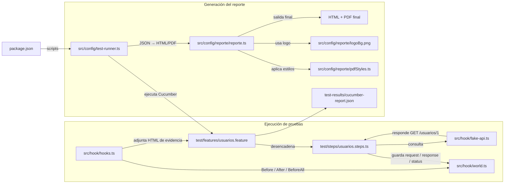

# Ejemplo de API — Playwright + Cucumber + Reportes HTML / PDF

Proyecto MVP que simula el consumo de un endpoint y genera reportes en formato HTML y PDF utilizando Cucumber. El proyecto incluye:

- Endpoint de prueba `GET /usuarios/1`, implementado con el módulo HTTP nativo de Node para simular una api real.
- Escenario BDD con estructura `Given`, `When`, `Then`.
- Directorios separados `test/features` y `test/steps`.
- Hooks `Before`, `After`, `BeforeAll` y `AfterAll`.
- Evidencia de request, response y status adjunta a cada escenario.
- Reportes HTML y PDF generados desde el mismo resultado JSON de Cucumber.

## Requisitos

- Node.js 20 o superior.
- npm.

## Instalación

```bash
npm install
npx playwright install chromium
```

## Ejecución completa
Este ejemplo genera el informe automaticamente una vez que finaliza la ejecución de la prueba automatizada.

```bash
npm run test:report
```

Se generan:

```text
test-results/
├── cucumber-report.json
├── Pruebas Automatizadas QA - API Ejemplo - Desarrollo.html
└── Pruebas Automatizadas QA - API Ejemplo - Desarrollo.pdf
```

También se pueden ejecutar las fases por separado:

```bash
npm test
npm run report
```

## Estructura

```text
reporteria-api-ejemplo/
├── src/
│   ├── config/
│   │   ├── reporte/
│   │   │   ├── logoBg.png
│   │   │   ├── pdfStyles.ts
│   │   │   └── reporte.ts
│   │   └── test-runner.ts
│   └── hook/
│       ├── fake-api.ts
│       ├── hooks.ts
│       └── world.ts
├── test/
│   ├── features/
│   │   └── usuarios.feature
│   └── steps/
│       └── usuarios.steps.ts
├── cucumber.js
├── package.json
├── tsconfig.json
└── test-results/
```

## Diagrama de dependencias y estructura




## Detalles técnicos de funcionamiento

El flujo está dividido en dos etapas: la ejecución de pruebas con Cucumber y la generación del reporte final en HTML/PDF.

### 1) Ejecución de escenarios con Cucumber

- `BeforeAll` levanta la API falsa local con `startFakeApi()`. Esto deja disponible un endpoint HTTP de ejemplo para que los escenarios no dependan de una infraestructura externa.
- `Before` inicializa el estado del `world` del escenario (`startedAt` y `baseUrl`), y deja el contexto listo para registrar request y response de cada caso.
- Durante el paso del escenario, el cliente HTTP hace la llamada real a la API y guarda la información en `this.request` y `this.response`.
- En el `After`, se construye el HTML de evidencias para la presentación del caso. La función `generarEvidenciaHtml(...)` arma una tabla con la request, la response y el status HTTP, y luego hace `this.attach(html, "text/html")` para que Cucumber asocie esa presentación visual al escenario.

Este fragmento del hook `After` es clave porque no solo guarda el resultado del caso, sino que también entrega la evidencia visual que se mostrará en la salida del reporte HTML del escenario.

### 2) Generación del reporte HTML

El script `src/config/test-runner.ts` lee el JSON generado por Cucumber y usa `cucumber-html-reporter` para producir un HTML base con metadata de ejecución, nombre del proyecto, ambiente, URL de la API, responsable y fecha.

Después de crear ese archivo, se aplica una etapa de “estilo” con `styleMetadata()`, que inyecta CSS para mejorar la distribución de los bloques de metadata y evitar que el contenido se vea desordenado.

### 3) Mejoras para la versión PDF

La parte más importante de la generación del PDF está en `src/config/reporte/reporte.ts`:

- `transformReport(page)` recorre el DOM del HTML generado por Cucumber y fuerza la expansión de secciones colapsables para que toda la información quede visible en el PDF.
- Ajusta el bloque de metadata para que se muestre con un layout más limpio y legible.
- Reestructura cada escenario para crear un encabezado con ID, título y estado (`Passed`/`Failed`).
- Reemplaza la vista de pasos por una presentación más compacta, mostrando request/response en columnas y agregando el status HTTP relevante.
- Remueve elementos visuales de depuración o modales que no aportan valor al documento final.
- Luego se llama a `page.pdf(...)` con configuración de tamaño A4, margen, header/footer y estilos específicos definidos en `pdfStyles.ts`.

Estas mejoras no son solo cosméticas: permiten que el reporte final sea usable como documento de evidencia en QA, con información clara del escenario, request, response, tiempos y estados sin perder legibilidad durante la impresión.

## Adaptarlo a otra API

1. Copia `src/config/reporte/` y la configuración `format` de `cucumber.js` al proyecto destino.
2. Copia `scripts/test-runner.ts` al proyecto destino si deseas incluir la logica para que tu reporte se genere automaticamente despues de la ejecución. Si ya tienes definido un esquema de generación de reporte, haz caso omiso a este archivo.
3. Conserva `generarEvidenciaHtml(...)` dentro de `test/hook/hooks.ts`. Si la mueves a un directorio helper/utils, debes agregar la referencia respectiva.
4. Sustituye el fake API y los steps por el cliente HTTP real del proyecto.
5. Cambia el logo en `src/config/reporte/logoBg.png` si corresponde.
6. Agrega los scripts `report` y `test:report` y las dependencias indicadas en este `package.json`.

No elimines reglas de `pdfStyles.ts` ni bloques de `styleMetadata()` o `transformReport()`: además de la apariencia, controlan el layout de metadata, estados de pasos, contenido extenso y saltos de página.

## Personalización

Las siguientes variables se incluyen en el archivo .env. Si no las incluyes debes detallarlas directamente en la clase reporte:

```bash
REPORT_TITLE="Informe de Pruebas Automatizadas"
REPORT_APPLICATION="MI APLICACION"
REPORT_URL="https://api.ejemplo.com"
REPORT_PLATFORM="APIS CAPA - XYZ"
REPORT_ENVIRONMENT="Desarrollo"
AUTOMATIZADOR="RONALD BAQUE"
REPORT_LOGO="src/config/reporte/logo.png"
```

